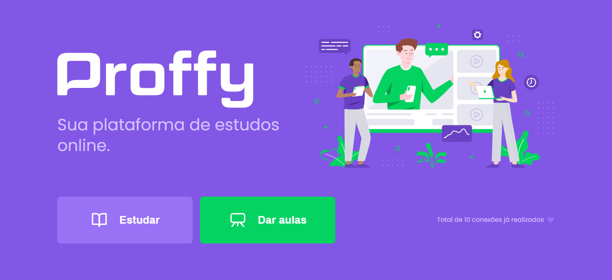
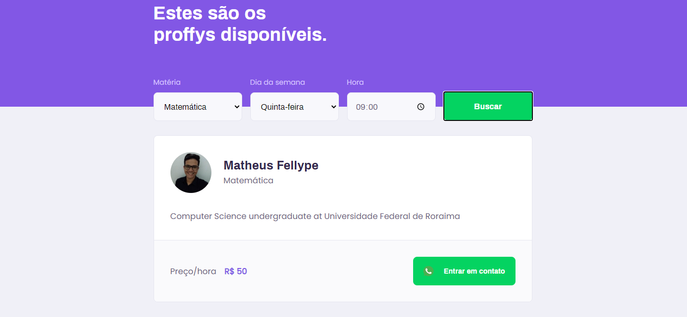
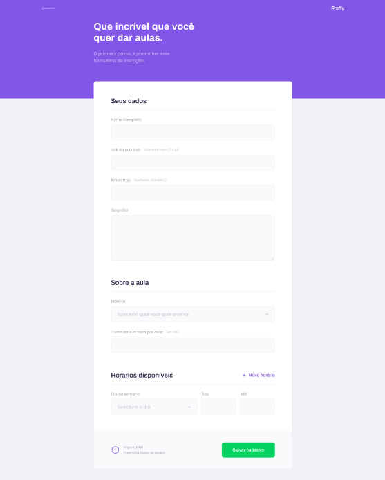

# Next Level Week#02 - PROFFY

Projeto desenvolvido na 2° edição da Next Level Week da Rocketseat onde foi utilizado as tecnologias NodeJS, ReactJS, React Native e TypeScript.

<h2><strong>:pushpin: Objetivo</strong></h2>

A aplicação tem como objetivo facilitar a comunicação entre alunos e professores, tais como agendar cada professor de acordo com sua matéria afim de ministrar a aula. 
A versão Web da aplicação permite o cadastro de Proffy(professsores) cada qual com a sua matéria, horário e custo que serão acessíveis na versão mobile.

<h3>:computer:Versão Web</h3>

 

<h3>:iphone:Versão Mobile</h3>

    
    
    
    
    

<h2><strong>:satellite: Tecnologias</strong></h2>

Versão Web: React + TypeScript
Versão Mobile: React-Native + TypeScript
Back-end: NodeJS + TypeScript

<h6>* Para verificar as tecnologias mais detalhadamente, acesse o package.json</h6>

<h2>:wrench: Sobre as Dependências:</h2>
Clone esse repositório e instale e/ou execute (pelo terminal):

<h3> Na API Server: </h3>

As dependências (instale): yarn install  
As migrates (execute): yarn knex:migrate  
Os seeds (execute):  knex:seed  
Para executar o server (execute): yarn start  
Obs: será executada na porta 3333

<h3> No Front-End: </h3>
As dependências (instale): yarn install  
Para executar o front-end (execute):  yarn start  
Obs: será executada na porta: 3000

<h3> No Mobile: </h3>
As dependências (instale): yarn install  
Para executar o mobile (execute):  yarn start.  
Obs: o expo irá abrir no browser com um QRCode, então será preciso ter baixado o app Expo para fazer a escaneação.  
Obs: Para instalar as fontes (execute): expo install expo-font @expo-google-fonts/archivo @expo-google-fonts/poppins

